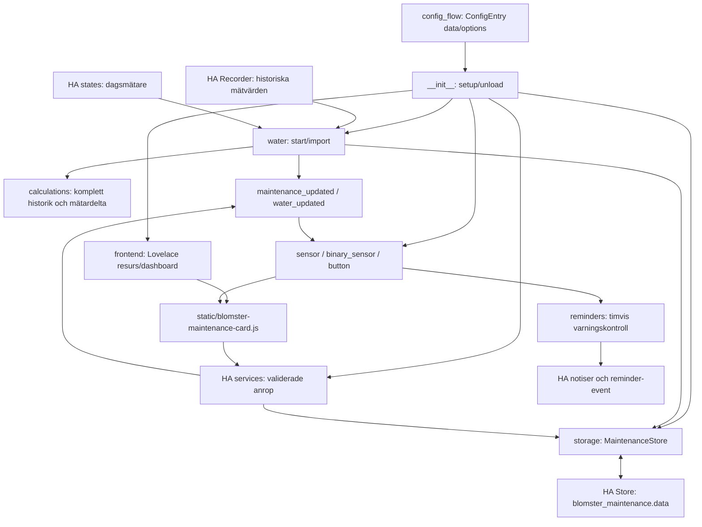

# Arkitektur

Dokumentationsversion: 2026-09-14.1. Avstämd mot integration 0.7.0.

`config_flow.py` skapar en konfigurationspost med vattenkälla, installationsdatum
samt Luba-entiteter. `__init__.py::async_setup_entry` registrerar kortets statiska
sökväg en gång, laddar `MaintenanceStore`, tillämpar postens data/options och skapar
standardobjekten för knivar och vattenfilter. Store delas med entitetsplattformarna
via `hass.data[DOMAIN][entry.entry_id]`.

`water.py` importerar Recorder-data i executor och godtar endast historik som täcker
periodens början och slut enligt `calculations.history_is_complete`. Vid ofullständig
historik behövs en manuellt satt baslinje. Därefter följer en state-listener aktuell
källa; en lägre dagsmätare räknas som återställning, inte negativ förbrukning.

Tjänsterna i `__init__.py` använder Voluptuous-scheman, ändrar Store och skickar event
som uppdaterar berörda entiteter. `record_maintenance` kan returnera postens ID:n för
ångra; delete identifierar en historikpost genom paret item_id/event_id. Det finns
ingen separat REST-route eller egen inloggning i integrationen.

`sensor.py`, `binary_sensor.py` och `button.py` äger entiteterna. Binary-sensorplattformen
startar `reminders.py`: timvis notis/reminder-event för aktuella problem. Kvittering
lagrar problemsignaturen, så ett förändrat problem kan åter bli synligt.

Frontend registrerar en Lovelace-modul och skapar en standarddashboard om den saknas;
en befintlig dashboard konfiguration skrivs inte över. YAML-resurser kräver manuell
registrering. Kortet anropar HA:s tjänste-API, inte Store direkt.

`async_unload_entry` avlastar plattformarna och tar bort postens Store-referens. Efter
sista posten tas tjänsterna bort. State-/event-listeners och reminder-timer registreras
med `entry.async_on_unload`. Kortets statiska sökväg och Lovelace-dashboard tas inte
bort av unload; de kan återanvändas vid nästa laddning.

Se [lagringskontraktet](storage.md) och [åtkomstkontraktet](access.md). CI testar
beräknings- och lagringsinvarianter, men ersätter inte verifiering på en riktig HA-installation.
